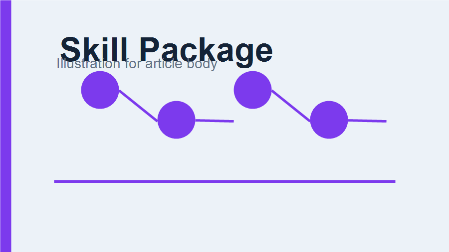

# 用一个真源维护多端 Agent Skills 分发

当同一组能力需要面向 Codex、Claude、OpenClaw 和 Hermes 分发时，最重要的不是复制更多目录，而是保留一个明确的真源。这个仓库把 `skills/` 作为唯一来源，再由构建脚本生成不同平台需要的归档和索引。



## 目录应该怎么分层

- `skills/` 保存可交付技能。
- `src/` 保存仓库维护工具。
- `registry/` 保存平台发布说明和 discovery 模板。
- `dist/` 只放构建产物，不提交。

## 构建产物

| 产物 | 用途 | 是否提交 |
|------|------|----------|
| skill zip | 单技能安装 | 否 |
| plugin zip | 平台插件包 | 否 |
| checksums | 发布校验 | 否 |
| well-known index | 远程发现 | 否 |

## 发布前校验

```bash
uv run holo-wechat-validate
uv run holo-wechat-build
```

## 维护原则

不要在多个平台目录中手工维护重复内容。重复目录会让修复、文档和脚本逐渐漂移，最终让发布结果难以解释。更稳妥的做法是让构建脚本把真源转换为需要的分发形态。
