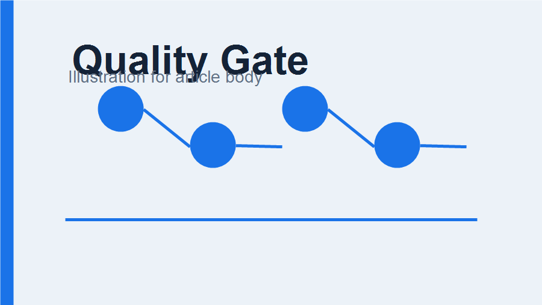

# 把质量门禁放在每一次提交之前

团队开始维护 Agent Skills 之后，最容易被低估的工作不是写脚本，而是让每次修改都能被稳定验证。一个清晰的质量门禁可以把“我本地试过”变成“所有人都能重复得到同样结果”。



## 为什么先做基线

第一阶段的目标不是一次性引入最严格的工程规范，而是让仓库有一个可信的最低标准。这个标准应该覆盖三件事：

- 技能目录结构仍然合法。
- Python 代码没有明显 lint 问题。
- 示例输入可以走完整的本地排版和 dry-run 校验。

> 基线的价值在于稳定，而不是复杂。它应该让维护者愿意频繁运行。

## 当前检查项

| 检查 | 命令 | 目的 |
|------|------|------|
| lint | `uv run ruff check .` | 发现明显代码问题 |
| format | `uv run ruff format --check .` | 避免无意义风格差异 |
| validate | `uv run holo-wechat-validate` | 保证技能包结构可分发 |
| tests | `uv run python -m pytest` | 覆盖 CLI 与示例回归 |

## 本地执行方式

```bash
uv sync --locked
uv run ruff check .
uv run ruff format --check .
uv run holo-wechat-validate
uv run python -m pytest --basetemp .tmp/pytest -p no:cacheprovider
```

## 落地建议

先把检查项做少，但每一项都要真实有效。等排版、草稿、图片上传的样例越来越多，再逐步把回归测试扩展到更多文章形态。
