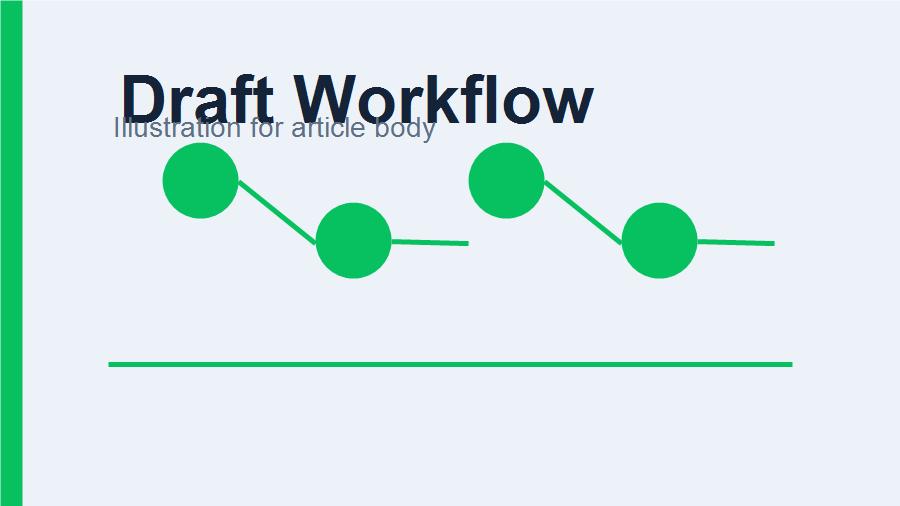

# 把 Markdown 稳定送进公众号草稿箱

公众号文章生产经常卡在最后一公里：内容写好了，图片也准备好了，但排版、上传、草稿创建之间缺少一条可以反复验证的路径。这个示例把链路拆成几个可观察的步骤。



## 一条推荐链路

1. 用 Markdown 保存正文和 front matter。
2. 用 typeset skill 生成微信兼容的内联样式 HTML。
3. 用 manage skill 的 dry-run 检查封面、标题、摘要和本地图片。
4. 在确认凭据可用后创建草稿，停止在 `media_id`，不自动发布。

> 草稿创建是可接受的验证边界；发布必须由操作者再次确认。

## 交付物

| 阶段 | 输入 | 输出 |
|------|------|------|
| 排版 | `article.md` | `article.html` |
| 预览 | `article.md` + theme | `article.preview.html` |
| dry-run | HTML + cover | JSON 校验结果 |
| 草稿 | HTML + cover + credentials | draft `media_id` |

## 命令示例

```powershell
uv run python skills/wechat-mp-typeset/scripts/typeset.py `
  examples/articles/wechat-draft-workflow/article.md `
  --theme pier `
  --output .tmp/examples/wechat-draft-workflow/article.html `
  --preview .tmp/examples/wechat-draft-workflow/article.preview.html
```

## 需要注意的细节

正文图片必须是本地文件或已经上传后的微信图片 URL。用于真实草稿验证时，脚本会先上传封面为永久素材，再上传正文图片并把 HTML 中的本地路径替换为微信返回的 URL。
